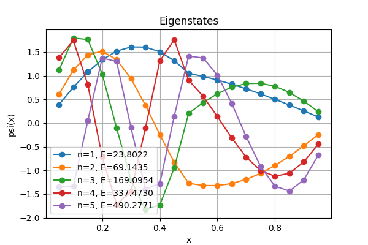
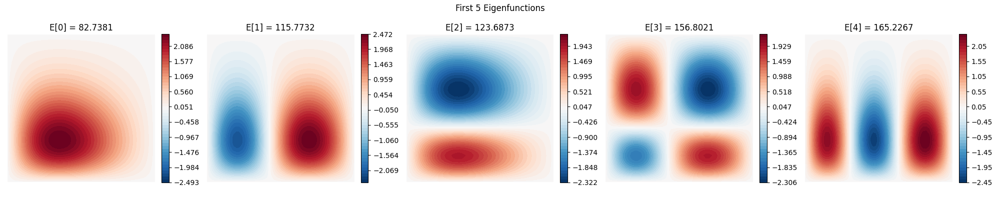

# FEM Study

Implementing a finite element solver (FEM) for eigenvalue problems of the form
```math
-\nabla \cdot \left( a(\vec{x}) \nabla \psi(\vec{x}) \right) + V(\vec{x}) \psi(\vec{x}) = E\psi(\vec{x})
```
on a 2D domain with Dirichlet boundary conditions.

## FEM
We triangulate the domain with some nodes $\\{\vec{x}_i \\}$ and use the hat functions $\phi_i(\vec{x})$ as the basis,
where $\phi_i(\vec{x}_i) = 1$ and it is piecewise linear on each triangle.
Writing $\psi(\vec{x}) \approx \sum_i \psi_i \phi_i(\vec{x})$, we obtain the generalized eigenvalue problem
```math
[H]\\{\psi\\} = E[M]\\{\psi\\}
```
where the Hamiltonian $[H]$ and the mass matrix $[M]$ satisfy
```math
H_{ij} = \int_\Omega dA \left( \nabla\phi_i \cdot \nabla\phi_j + V \phi_i \phi_j \right) \\
M_{ij} = \int_\Omega dA \phi_i \phi_j.
```

## Triangulation
[triangulate.c](./test_fem_2d/triangulate.c) performs the triangulation.
Given a set of nodes, with boundary points marked as such,
it performs the [Bowyer-Watson algorithm](https://en.wikipedia.org/wiki/Bowyer%E2%80%93Watson_algorithm)
to output a valid [Delaunay triangulation](https://en.wikipedia.org/wiki/Delaunay_triangulation) of the domain.
It does not support angle or area constraints for the moment,
nor can it introduce new nodes.
For simple equally-spaced square nodes,
[create_nodes.py](./test_fem_2d/create_nodes.py) can be used to generate them.

## Assembly and Solution
[hamiltonian.c](./test_fem_2d/hamiltonian.c) assembles the mass matrix and the Hamiltonian matrix,
defined as before.
[solver.py](./test_fem_2d/solver.py) then uses the constructed matrices to solve the eigenvalue problem
using `scipy.linalg.eigh`.

## Usage
```bash
$ gcc triangulate.c -o triangulate -lm
$ gcc hamiltonian.c -o hamiltonian
$ ./run.sh
```

## Example
1D ($a(x)=1 (x<0.5), a(x) = 5 (x > 0.5), V(x) = 0$):


2D ($a(\vec{x}) = 1, V(\vec{x}) = 50x + 100y$):

